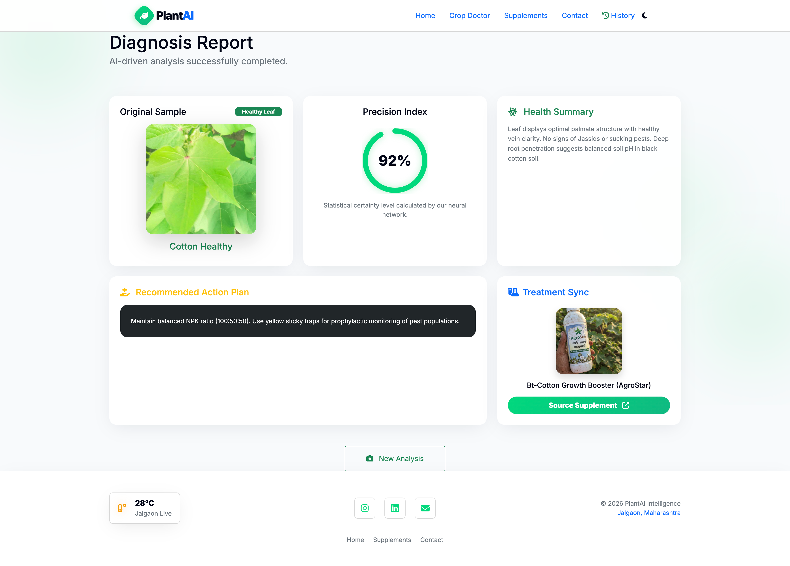

# 🌿 AgriCrop — AI Crop Disease Detection System

> A deep-learning powered web application that detects plant leaf diseases from images and provides treatment recommendations for farmers.

AgriCrop is a final-year Artificial Intelligence project built to solve a real agricultural problem: **late disease identification causes major crop loss**.
The system uses a **custom Convolutional Neural Network (CNN)** (not transfer learning) to analyze leaf images and predict the disease with high reliability.

---

## 🔗 Live Concept

Upload a leaf image → Model analyzes → Disease predicted → Farmer receives solution.

---

## ⭐ Features

* Image-based crop disease detection
* Custom trained CNN model (PyTorch)
* 55% confidence safety rejection (prevents wrong prediction)
* Treatment & pesticide recommendation
* Prediction history storage (SQLite DB)
* Responsive web interface
* Farmer-friendly usage
* Evaluation metrics & confusion matrix

---

## 🧠 Model Information

| Property      | Value                          |
| ------------- | ------------------------------ |
| Architecture  | Custom CNN                     |
| Framework     | PyTorch                        |
| Input Size    | 224×224                        |
| Special Logic | Confidence Threshold Rejection |
| Threshold     | 55%                            |

### Reliability Mechanism

If the prediction confidence is less than **55%**, the system will not guess.

Instead it shows:

> "Model not confident — Please upload a clearer leaf image."

This avoids misleading farmers and makes the system practical for real-world use.

---

## 📊 Model Performance

| Metric    | Score      |
| --------- | ---------- |
| Accuracy  | **91.25%** |
| Precision | **0.9276** |
| Recall    | **0.9125** |
| F1 Score  | **0.9071** |

Confusion Matrix available in:

```
static/confusion_matrix.png
```

---

## 🛠 Tech Stack

**Frontend**

* HTML
* CSS
* Bootstrap
* Jinja2

**Backend**

* Python
* Flask

**AI / ML**

* PyTorch
* Torchvision
* OpenCV
* NumPy
* Scikit-learn
* Matplotlib

**Database**

* SQLite

---

## 📁 Project Structure

```
AgriCrop/
│
├── app.py
├── CNN.py
├── model_evaluation.py
├── evaluate_model.py
├── test_prediction.py
│
├── jalgaon_project/
│   ├── jalgaon_disease_model.pt
│   └── dataset/
│
├── templates/
├── static/
├── demo_images/
├── test_images/
├── predictions.db
├── requirements.txt
└── README.md
```

---

## ⚙️ Installation

### 1. Clone Repository

```bash
git clone https://github.com/YOUR_USERNAME/AgriCrop.git
cd AgriCrop
```

### 2. Create Virtual Environment

```bash
python -m venv venv
```

Activate:

**Windows**

```
venv\Scripts\activate
```

**Mac/Linux**

```
source venv/bin/activate
```

### 3. Install Libraries

```bash
pip install -r requirements.txt
```

### 4. Run Application

```bash
python app.py
```

Open:

```
http://127.0.0.1:5000
```

---

## 🔍 Methodology

1. User uploads leaf image
2. Image preprocessing (resize + normalization)
3. Passed to CNN model
4. Softmax probability calculated
5. Confidence threshold check
6. Disease predicted
7. Recommendation displayed
8. Stored in database

---

## 🌾 Supported Diseases

* Healthy Leaf
* Leaf Spot
* Rust
* Bacterial Infection
* Other common crop diseases

---

## 📸 Screenshots

(Upload images inside `demo_images` folder and reference them)

Example:

```


```

---

## 🚀 Future Improvements

* Android mobile app
* Marathi & Hindi language support
* Weather-based prediction
* Farmer chatbot assistant
* Fertilizer marketplace integration

---

## 👨‍💻 Author

**Krishna Anil Badgujar**
BCA Student — Artificial Intelligence Enthusiast

Skills: Python • Machine Learning • Web Development 

---

## 📜 License

Educational / Academic Use Only
